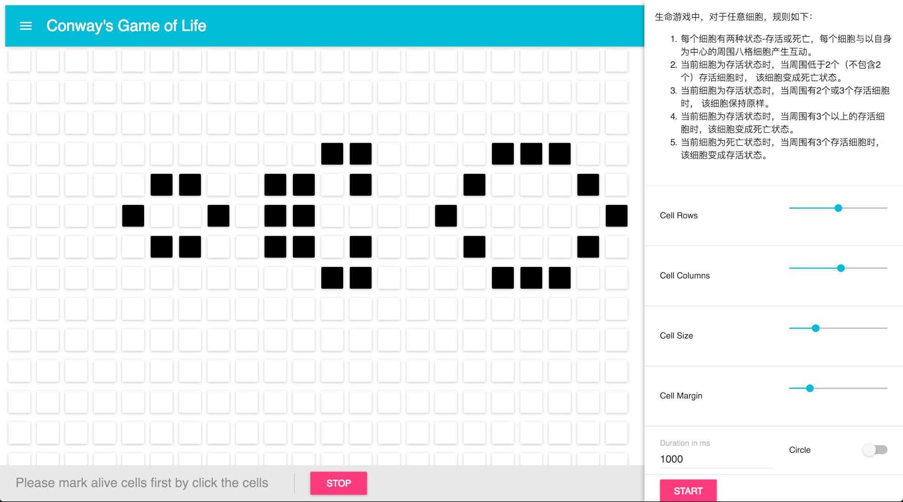
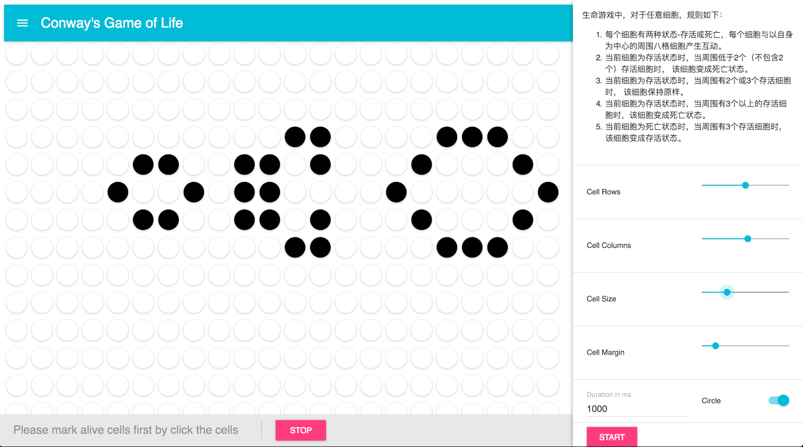

## Get Started - Conway's Game of Life [](https://travis-ci.org/Waterstrong/game-of-life-js)

Just practice TDD, Refactor, Shortcut and ES6-FP. Please refer to the each baby step if you are interested.

Also introduce the `React` and `yarn` by [Kai Hu](https://github.com/WrongKey).

```
yarn install  # install dependencies, requires node ^5.0

yarn test  # run the tests and generate the report

yarn start  # Start the Game of Life
```

To checkout the test report: open `mochawesome-report/mochawesome.html`


The UI part is provided by [Kai Hu](https://github.com/WrongKey).




